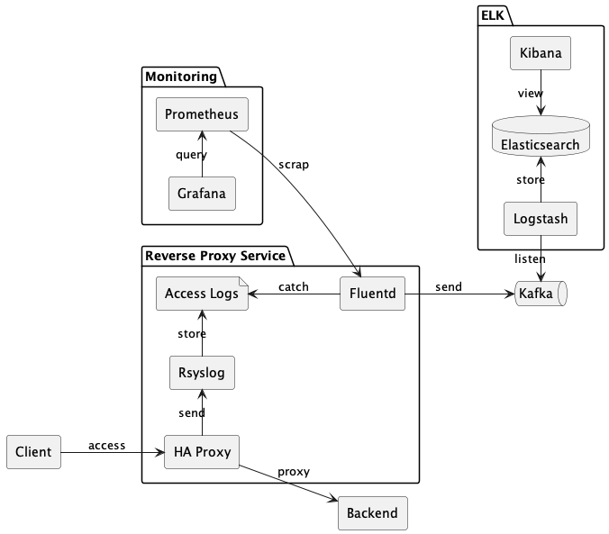

## Logarchive

`Logarchive` is a implement of architecture for collecting logs from `haproxy` to `elasticsearch`, all services on this architecture are containerization, you can deploy to your openshift environment. please take a look the diagram below:

### Reference Tools & Images
- [openshift-router](https://github.com/openshift/router)